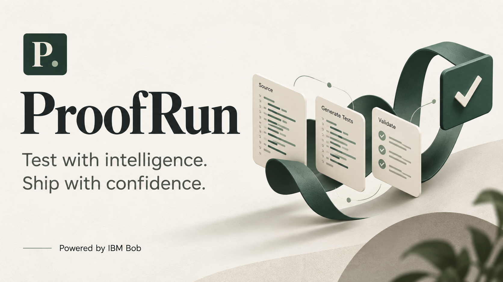

# ProofRun



**An AI software QA workspace powered by IBM Bob.**

ProofRun reads a submitted project, plans its execution, runs practical tests in disposable Docker environments, and explains observed failures. Developers inspect concrete diffs and use **Approve & repair all** to apply pending proposals to a managed copy. ProofRun then reruns unchanged checks and reports regressions.

## Start here

```powershell
git clone https://github.com/bilalqaiserw/proofrun.git
cd proofrun
```

1. Install **Node.js 24**, Docker Desktop with **Linux containers**, and IBM Bob Shell.
2. Follow [SETUP.md](SETUP.md) for Docker, WSL, account, license and API configuration.
3. Put your IBM Bob inference key in **BOBSHELL_API_KEY** inside **.env**, beside package.json. Never put it in browser code or Git.
4. Start Docker Desktop, run `npm start` from this folder, and open http://localhost:3000.

There are no application npm packages to install. `npm run setup:bob` installs Bob Shell locally for a fresh download. Your original connected folder remains unchanged.

## Documentation

- [Project description](PROJECT.md): problem, users, workflow and architecture.
- [Complete setup guide](SETUP.md): installation, key configuration, first run and troubleshooting.
- [Vercel deployment](docs/VERCEL.md): private cloud execution, server secrets and session limits.
- [Live cloud verification](docs/CLOUD_VERIFICATION.md): measured upload, test, approval, repair and retest evidence.
- [Architecture](docs/ARCHITECTURE.md) and [API](docs/API.md).
- [Verification and limits](docs/TESTING.md).
- [Video recording guide](docs/DEMO_90_SECONDS.md).
- [Pitch deck](presentation/ProofRun-final-pitch.pptx) and [speaker script](presentation/VIDEO_SCRIPT.md).
- [IBM Bob usage](docs/IBM_BOB_USAGE.md) and [task session evidence](bob_sessions/README.md).
- [Submission checklist](docs/SUBMISSION.md) and [security policy](SECURITY.MD).

## Repository structure

```text
proofrun/
  README.md                  Project entry point
  PROJECT.md                 Problem and solution overview
  SETUP.md                   Complete installation instructions
  SECURITY.MD                Credential and execution boundaries
  .bobignore                 IBM template protections plus local exclusions
  .gitignore                 IBM template protections plus local exclusions
  .env.example               Placeholder server configuration
  package.json               Start and verification commands
  bob_sessions/              Authentic Bob IDE task summaries
  docs/                      Architecture, API, tests and submission details
    evidence/                Historical measured demo evidence
    history/                 Historical setup verification, explicitly labelled
  presentation/              Editable pitch and video script
  public/                    Browser workspace and styles
  src/server.ts              Local Node service and internal API
  src/qa/                    Bob reasoning, orchestration and approval logic
  worker/                    Container HTTP/browser/download workers
  scripts/                   Bob Shell installer
  examples/shipping-service/ Deliberately faulty, labelled demo application
  tests/                     Workflow, safety, Docker and live Bob gates
```

Local-only .env, .tools/, .proofrun-data/ and work/ stay outside Git and the submission ZIP. The root layout follows IBM's security template and the required bob_sessions folder. The template does not prescribe relocating runtime code.

## Use ProofRun

Click **Test My App**, choose a source folder and create the testing workspace. Watch analysis, setup and practical execution. **Overview** explains the program and its languages. **Issues** shows reproduction inputs, execution evidence and proposed diffs. **Tests**, **Logs** and **Validation** retain the measured outcomes.

Edit or reject proposals individually. The main **Approve & repair all** button explicitly approves every remaining pending revision, applies compatible patches together, and starts one verification run. Rejected changes stay excluded. Findings without a safe patch remain open. Conflicting replacements or stale source stop approval before writes. Download the readable Markdown report or the managed working copy.

## Verify

```powershell
npm test
npm run test:docker
npm run test:live
```

The latest local regression suite passed **42 tests, 0 failures and 0 skips**. It uses labelled reasoning substitutes and owned fixtures, with real HTTP requests and child processes. Separate earlier production Bob/Docker/Chromium evidence recorded **11 unchanged application checks passing after approval**, with **0 regressions**, on the labelled checkout fixture. These are different measurements. Live gates require Docker/Bob and may consume Bobcoins. A skipped gate does not establish a pass.

## Scope

File intake accepts varied languages and layouts. Execution supports configured Linux runtime images, HTTP applications, browser workflows and CLI checks. Native desktop/mobile software, private dependencies, hardware and unavailable integrations need additional adapters or test data. Inferred requirements can be wrong and coverage is bounded. ProofRun is a local developer tool, not a certification of arbitrary software or a public service for hostile code.
