# Architecture

```mermaid
flowchart LR
  U[Internal browser workspace] --> API[Loopback Node API]
  API --> J[Managed project and job state]
  J --> AI[Bob reasoning: tools disabled]
  AI --> V[Validated plan and test contracts]
  V --> D[Docker execution layer]
  D --> E[Requests, logs, exits and screenshots]
  E --> R[Issue report and proposed diff]
  R --> A[User approval of exact revision]
  A --> P[Patch managed source copy]
  P --> T[Fresh environment and unchanged tests]
  T --> R
```

## Reasoning

`BobReasoner` invokes the official IBM Bob Shell through argv and stdin. Only the host process inherits `BOBSHELL_API_KEY`; source and test containers receive synthetic configuration. No key is placed in prompts, frontend source, API responses, Docker environment or Git-tracked files.

Bob returns structured artifacts. The adapter unwraps the CLI envelope, extracts one complete object from prose or a code fence, rejects ambiguous/truncated content and retries a prose-only response once. It never evaluates model text as host code. It plans setup, generates tests, interprets failures and proposes full replacement text plus explanations/risks. Tool groups, MCP and subagents are disabled. Repository files/logs are labelled untrusted input. Prompt injection cannot grant host tool permissions; bad plans are still constrained by contract validation and container boundaries.

The engine may satisfy bounded `readFiles` requests against the submitted file inventory. It never allows a model-selected absolute path. Incomplete excerpts are expanded before accepting a full-file repair; oversized/binary files receive no guessed source replacement.

## Execution

`DockerExecutor` owns image selection, networks, volumes, process startup, dependency egress, timeouts and cleanup. Runtime commands use argv with `shell:false` on the host; a project's shell can be invoked only inside its unprivileged container. Trusted executor workers are separate from submitted source.

- Per-session source, services and internal network; no application ports published on the host.
- UID 1000, dropped capabilities, no-new-privileges, default Docker seccomp, read-only root filesystem, 1.5 GB memory, four CPUs for setup/existing suites or two per independent prepared workflow, 256 PIDs and file-descriptor limits.
- A bounded 2 GB tmpfs volume holds source/dependencies; runtime `/tmp` has a 1 GB bound, and database storage is separately bounded. Docker's documented [local tmpfs volume options](https://docs.docker.com/reference/cli/docker/volume/create/) are used. An init container keeps the mount alive during transfer to the application.
- No host directory, Docker socket or server secret is mounted into project containers.
- Dependency downloads use a trusted package-host allowlist proxy with public-IP checks; the proxy is stopped before a server application starts. Non-web setup/command phases retain that restricted package egress.
- Disposable PostgreSQL/MySQL/Redis containers wait for readiness. They use synthetic `qa` credentials, not real databases.
- HTTP worker sends concrete inputs, captures response IDs and preserves their types, checks assertions and records full reproduction traces within output limits.
- Browser worker performs declarative Playwright actions, blocks external origins, captures frontend/network failures and exports actual screenshots.
- Every generated workflow receives fresh setup/database state. A 30-minute job deadline and process timeouts prevent endless runs.

Containers share a kernel. Registry allowlists are destination restrictions, not a proof of zero data exfiltration. The local service should run on a dedicated worker for hostile code, and should not be exposed publicly as a multi-tenant service. OS/hardware-specific execution remains outside these adapters.

## Toolchain preparation and timeouts

For Node 22/24 plans, a trusted bootstrap reads `packageManager` only from contained project manifests, validates exact pnpm/Yarn versions, and installs those tools under `/tmp/proofrun-tools` with npm install scripts disabled. Arbitrary package URLs and conflicting workspace versions cannot select a bootstrap download. Project dependency lifecycle scripts subsequently run only in the isolated container. Local Node headers and a workspace-local pnpm store avoid unnecessary downloads and tiny temporary-store exhaustion.

Vitest workers are capped at two to prevent host CPU detection from oversubscribing the sandbox, without disabling file isolation or changing assertions. The variables cover [Vitest 3 pools](https://v3.vitest.dev/config/#pooloptions) and [Vitest 4 workers](https://vitest.dev/guide/migration.html). Build deadlines are normalized to 300-600 seconds; existing suites have a 600-second command deadline, preserving their internal per-test timeouts. Timeouts are inconclusive observations, with exact argv/cwd/deadline in reports. The executor stops the affected container; the engine restores a fresh prepared copy before executing remaining suites. Environment failures receive environment remediation, not speculative application patches.

## Approval and regression validation

Proposals store file hashes, full before/after text, a readable diff, explanation, risks, revision and whole-project snapshot. Preparing/rejecting/editing a proposal does not modify source. Approval requires `approved:true`, the current revision and unchanged snapshot/file hashes. Tests, credentials and generated dependency directories are protected.

Approved files are written only to the managed source copy. Retesting rebuilds fresh containers, runs existing suites and reuses the persisted generated test contracts. The engine records whether the relevant original failure passes, whether contracts stayed identical, and whether previously passing workflows failed or became inconclusive. Original evidence is retained alongside validation history.

## Prepared execution

Installation/build complete once before a run-local filesystem snapshot is captured. The snapshot has a 3 GB bound and preserves hard links, symlinks, executable modes, `/workspace` and `/tmp` (including project-local home state). It is mounted read-only to trusted restore helpers, which copy it into each workflow's separate bounded volumes. Prepared workflows reuse immutable trusted runner files and need no dependency proxy. Their app containers use network none; HTTP/Chromium workers join that isolated namespace and reach even localhost-bound servers. Each workflow retains its own application process and isolated network namespace; source contracts and evidence collection are unchanged. Up to two independent prepared workflows execute concurrently. Snapshot resources are discarded at the end of the run. Approved patches cause new installation/build and a new snapshot before unchanged retesting.

Database-backed plans use fresh setup for every workflow: filesystem reuse alone cannot reproduce schema/fixture initialization performed during installation/build. If snapshot creation fails, the runner also falls back to fresh setup. Runtime image availability is checked locally before pulling missing images; no prepared snapshot is shared across projects or across runs.

## Persistence and UI

Each workspace lives under `.proofrun-data/<UUID>/` with source, atomic job/report JSON and captured artifacts. Writes are serialized per workspace. Interrupted runs are marked interrupted after restart rather than silently resumed. Graceful shutdown aborts jobs and allows cleanup to finish; a forced OS kill can leave labelled Docker resources requiring operator cleanup.

The browser polls job state and presents Overview, Issues, Tests, Logs and Validation. Source previews, editable diffs, approval/rejection, screenshots, report download and working-copy export use same-origin APIs with a required `x-proofrun` header. The server binds `127.0.0.1`, validates Host/Origin, caps request size and sets a restrictive content policy.

## Scope of verification

Owned fixture integration tests verify the actual API, HTTP/CLI worker execution, reports, approval edits/rejection, stale revision/snapshot protection, patch writes, retesting, regression detection and ZIP export. The test reasoning substitute and host fixture executor are not production options. Separate gates exercise real Docker and real Bob when their prerequisites are available. See TESTING.md for the current measured results.

## Reporting continuity

The generation schema defines command fields and supported browser actions explicitly. Harmless omitted display labels are derived after argv validation; execution bounds remain strict. Literal numeric/required control metadata is extracted from supplied source and used to reject impossible generated interactions. The trusted browser worker supports native validity assertions through fixed worker code, not arbitrary model JavaScript. Dynamic or ambiguous controls are left to runtime evidence.

Generation begins immediately after plan validation and overlaps setup/build. A source-hashed proposal cache preserves the original response. Formatting failures receive one compact, bounded correction with the error and previous proposal; no new source retrieval is offered during that correction. Inference timing/progress are persisted and exported. A fresh analysis may recompile a previously invalid proposal for identical source; approved repair retests always use the already saved test contract unchanged.

The status API advertises protocol version 4. The current UI refuses mutations against an older server and offers an updated-service link, preventing an old process on another port from running stale orchestration. Reports expose a prominent next action: review a proposed repair, generate one, or regenerate a faulty test. Findings classified as faulty test expectations invalidate the proposal cache and pass their corrections into new generation. Source repair approval continues to preserve saved test contracts unchanged.

Existing suites run while Bob generates practical contracts. Suites launch the app only when their documented command requires it. Related findings can share one concrete proposal and approval. Failed reasoning leaves execution evidence and a coverage warning, rather than a invented setup exit code. A bounded background repair can be cancelled. Continuation requires exact unchanged source and hashes of completed passing suites, then executes every new generated check in a fresh environment.

## Audit reliability changes

- A loopback socket keyed to the workspace directory gives one process ownership of the store. OS cleanup releases it on process exit/crash; a second process fails with the owner's URL. It is a local ownership signal with no execution API or credentials.
- Browser PNG bytes travel through a bounded worker JSON response, are validated and saved on the host with a session-specific filename, and are removed from the public result transport. Retests retain earlier images. This replaces a Docker copy operation that silently omitted live tmpfs contents.
- Approval holds its workspace mutation lock until retesting acquires the active execution slot. Reports identify the approved source snapshot even if verification is interrupted.
- An individual repaired issue and an entirely passing suite are reported separately. Empty verification cannot resolve a setup issue. Malformed URLs return JSON errors rather than escaping the request handler.
- UI navigation revisions prevent late requests from showing another project's state. Back/Forward follows the URL; uploads and downloads show explicit progress and prevent duplicate submission. Cancellation and process recovery clear stale activity indicators.
